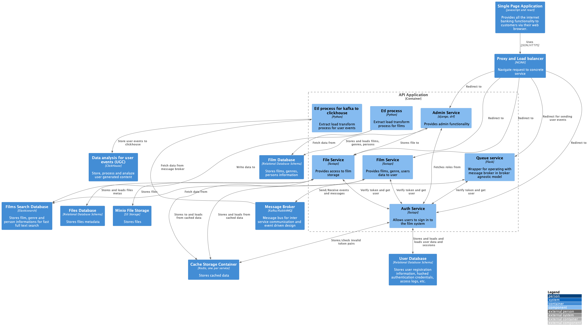

<h1> Async API - API для онлайн кинотеатра</h1>

<h2> 1. Общие сведения о проекте  </h2>

 Async API - асинхронный API для онлайн-кинотеатра, позволяющая получать информацию фильмах, актерах и жанрах на базе REST. 
    В качестве базовой архитектуры программного обеспечения используется микросервисная архитектура. 

 
    Полный исходный код проекта расположен по <a href="https://github.com/ProTupfe4/Auth_sprint_2"> ссылке. </a>
    В рамках проекта реализованы следующие сервисы:
    <ol>
        <li> 
            <a href="./django_admin">Интерфейс администратора </a> - сервис отвечающий за создание, редактирование и 
            удаление информации о фильмах, жанрах и персоналиях. Реализован с помощью 
            <a href="https://www.djangoproject.com"> Django, </a> 
            а также <a href="https://www.django-rest-framework.org"> Django Rest Framework </a> 
            для обработки REST запросов 
        </li>
        <li> 
            <a href="./etl"> ETL сервис </a> - для динамической обновления состояния объектов после изменений производимых
            в админке Django
        </li>
        <li> 
            <a href="./filmwork_service"> Сервис </a> для получения сведений о фильмах, с возможностью поиска, фильтрации
            и пагинации. Выполнено с помощью <a href="https://fastapi.tiangolo.com"> FastAPI </a> c поддержкой кэширования в 
            <a href="https://redis.io"> Redis </a> 
        </li>
        <li> 
            <a href="./person_genre_service"> Сервис </a> для получения сведений о персоналиях и жанрах с возможностью
            поиска, фильтрации и пагинации. Выполнено с помощью <a href="https://fastapi.tiangolo.com"> FastAPI </a> c поддержкой кэширования в 
            <a href="https://redis.io"> Redis </a> 
        </li>
        <li> 
            <a href="./tests"> tests </a> Папка содержащая исходный код тестов. В данный момент в ней содержатся функциональные тесты сервиса.
             Реализованы тесты с использованием <a href="https://docs.pytest.org/en/7.4.x/"> Pytest </a> и <a href="https://faker.readthedocs.io"> Faker </a>
        </li>
        <a> 
            <a href="./file_service"> file_service </a> Папка содержащая исходный код сервиса для обслуживания файлов. Выполнено с помощью <a href="https://fastapi.tiangolo.com"> FastAPI </a> c поддержкой кэширования в 
            <a href="https://redis.io"> Redis </a> и использованием s3  хранилища <a href="https://min.io"> minio </a>
        </li>
        <li>
            <a href="/auth_service"> auth_service </a> Папка содержащая исходный код сервиса авторизации и работы с пользователями.
            Выполнена с помощью <a href="https://fastapi.tiangolo.com"> FastAPI </a> c поддержкой кэширования в 
            <a href="https://redis.io"> Redis </a>, поддержкой jwt токенов посредством использования библиотеки <a href="https://indominusbyte.github.io/fastapi-jwt-auth/"> Fastapi Auth JWT </a>, 
            хешированием паролей с помощью библиотеки <a href="https://passlib.readthedocs.io/en/stable/"> passlib </a>. В качестве ORM была использован библиотека <a href="https://docs.sqlalchemy.org/en/20/index.html"> SQLAlchemy </a> 
            совместно со средствами миграции <a href="https://alembic.sqlalchemy.org/en/latest/"> Alembic </a> и консольным управлением посредством использования библиотеки <a href="https://typer.tiangolo.com"> Typer </a>
        </li>
    </ol>

    В рамках проекта используются следующие сторонние инструменты:
    <ul>
        <li>
            <a href="https://www.elastic.co"> Elasticsearch </a> - в данном проекте он служит базой данных для REST сервисов. Также он служит
            хранилищем для полнотекстового поиска и в нее подгружаются изменения производимые на стороне админки
        </li>
        <li> 
            <a href="https://redis.io"> Redis </a> - используется для хранения состояний некоторых фрагментов ETL пайплана, а также хранилищем 
            кэша REST сервисов
        </li>
        <li> 
            <a href="https://www.postgresql.org"> Postgres </a> - СУБД с которой общается Админка.
        </li>
        <li> 
            <a href="https://docs.nginx.com"> NGINX </a> - reverse proxy, который проксирует запросы а также хранит и обрабатывает
            запросы, также представляя статику
        </li>
        <li>
            <a href="https://www.docker.com"> Docker </a> - отвечает за упаковку сервисов в контейнеры и развертывание 
            сервиса посредством <a href="https://docs.docker.com/compose/"> Docker Compose </a>
        </li>
    </ul>

<h2> 2. Структура проекта </h2>

    <pre>
    .
    ├── django_admin                            # Сервис администрирования
    │   ├── app/                                # Исходный код сервиса администрирования на Django и Django REST Framework
    │   ├── Dockerfile            
    ├── elastic                                 # Сервис Elasticsearch. Мы собираем свой образ на базе образа elasticsearch:8.6.2
    │   ├── Dockerfile  
    ├── envs                                    # Папка в которой хранятся примеры env файлов, необходимых для развертывания приложения
    │   ├── .env.api.films.example              # Пример env файла для сервиса фильмов.
    │   ├── .env.api.database.example           # Пример env файла для сервиса баз данных  postgres.
    │   ├── .env.api.django.example             # Пример env файла для сервиса администрирования.
    │   ├── .env.api.etl.example                # Пример env файла для сервиса ETL.
    ├── etl                                     # Сервис ETL. 
    │   ├── Dockerfile  
    ├── filmwork_service                        # REST сервис для получения сведений о фильмах, с возможностью поиска, фильтрации и пагинации.
    │   ├── src/                                # Исходный код сервиса
    │   ├── tests/                              # Unit тесты
    │   ├── docker-entrypoint.sh                # скрипт для запуска контейнера
    │   ├── requirements.txt
    │   ├── Dockerfile
    ├── nginx                                   # Reverse Proxy nginx. Мы собираем свой образ на базе nginx:latest docker образа
    │   ├── config/                             # Папка содержащая конфигурационные файлы cервисов nginx  
    │   ├── Dockerfile
    ├── postgres                                # Сервис базы данных Postgres. Мы собираем свой образ на базе postgres:latest докер образа
    │   ├── Dockerfile 
    │   ├── init.sql  
    ├── file_service                            # REST сервис для получения сведений о файлах, с возможностью поиска и пагинации.
    │   ├── src/                                # Исходный код сервиса
    │   ├── tests/                              # Unit тесты
    │   ├── docker-entrypoint.sh                # скрипт для запуска контейнера
    │   ├── requirements.txt
    │   ├── Dockerfile
    ├── auth_service                            # REST сервис авторизации.
    │   ├── src/                                # Исходный код сервиса
    │   ├── tests/                              # Unit тесты
    │   ├── docker-entrypoint.sh                # скрипт для запуска контейнера
    │   ├── requirements.txt
    │   ├── Dockerfile
    ├── tests                                   # Тесты привязанные к проекту
    │   ├── envs/                               # Переменные окружения необходимые для работы тестов
    │   ├── functional/                         # Функциональные тесты
    │   ├── Dockerfile                          # Dockerfile
    │   ├── docker-compose-tests.yaml           # docker-compose файл  
    ├── .flake8
    ├── .pre-commit-config.yaml
    ├── docker-compose-dev.yaml
    ├── Makefile
    └── README.md
    </pre>

<h2> 3. Предполагаемая архитектура проекта </h2>

Далее представлена высокоуровневая модель взаимодействия пользователя с итоговой системой.

Взаимодействие подсистем детальнее представлена на следующей модели:

</img>

<h2> 4. Развертывание </h2>

 
    Для того чтобы развернуть данное решение необходимо совершить следующие шаги:
<ol>
    <li>
        Нужно склонировать репозиторий:
        <code> git clone git@github.com:ProTupfe4/Auth_sprint_1.git </code>
    </li>
    <li>
        Необходимо поместить необходимые env файлы в папку <code>envs/</code> Примеры необходимых рабочих env файлов представлены
        в папке <code>envs/</code> c расширением <code>.example</code>
    </li>
<li>
        Для запуска сервисов можно прописать либо <code>make run-dev</code> (для этого требуется установленный <b>Make</b>) либо 
        <code>docker-compose -f docker-compose-dev.yaml up. </code>
        

            <b>Сервис django-admin</b> будет доступен по порту <b> 81 </b> (по умолчанию). В данном сервисе есть две основные ручки:
            <ol>
                <li> 
                    <code>/admin</code> - открывается доступ к интерфейсу администратора. Для создания суперпользователя
                    можно воспользоваться командой <code>make admin-dev</code>. Создастся суперпользователь с логином my_admin и паролем PpAaSs!123
                </li>
                <li>
                    <code>/api/v1/movies</code> - для извлечения данных из базы данных postgres
                </li>
            </ol>
        

        

            <b>REST сервис для фильмов </b> доступен без swagger, для REST по порту <b>81</b> (по умолчанию) по путям <code>/api/v1/films</code> для получения сведений о фильмах, <code>/api/v1/genres</code> для получения сведений о жанрах, <code>/api/v1/persons</code> для получения сведений о персоналиях и <code>api/films</code> для swagger.
            Подробнее о сервисе можно узнать <a href="./filmwork_service"> здесь. </a>
        

        

            <b>REST сервис для файлов </b> доступен без swagger, для REST по порту <b>81</b> (по умолчанию) по путям <code>/api/v1/files</code> для получения сведений о файлах и <code>/api/files</code> для swagger.
            Подробнее о сервисе можно узнать <a href="./file_service"> здесь. </a>
        

         

            <b>REST сервис авторизации </b> доступен без swagger, для REST по порту <b>81</b> (по умолчанию) по путям <code>/api/v1/(users|accounts|roles)</code> для получения сведений о файлах и <code>/api/auth</code> для swagger.
            Подробнее о сервисе можно узнать <a href="./auth_service"> здесь. </a>
        

        

            Сервис Elasticsearch для взаимодействия с внешним миром прокинут по порту <b>9200</b>
        

    </li>
    <li>
        Необходимо зайди на страницу <a href="https//localhost:9001">minio </a> и создайте bucket. 
        По умолчанию можно использовать bucket movies. Создайте access_key и secret_key. Введите их в соответствующие поля
        в файле .env.files
    </li>
    <li>
        Перезапустите сервисы с помощью <code>make run-dev</code> (для этого требуется установленный <b>Make</b>) либо 
        <code>docker-compose -f docker-compose-dev.yaml up. </code>
    </li>
    <li>
        Для остановки работы сервиса необходимо прописать <code>make stop-dev</code> или 
        <code>docker-compose -f docker-compose-dev.yaml</code>
    </li>  
</ol>

